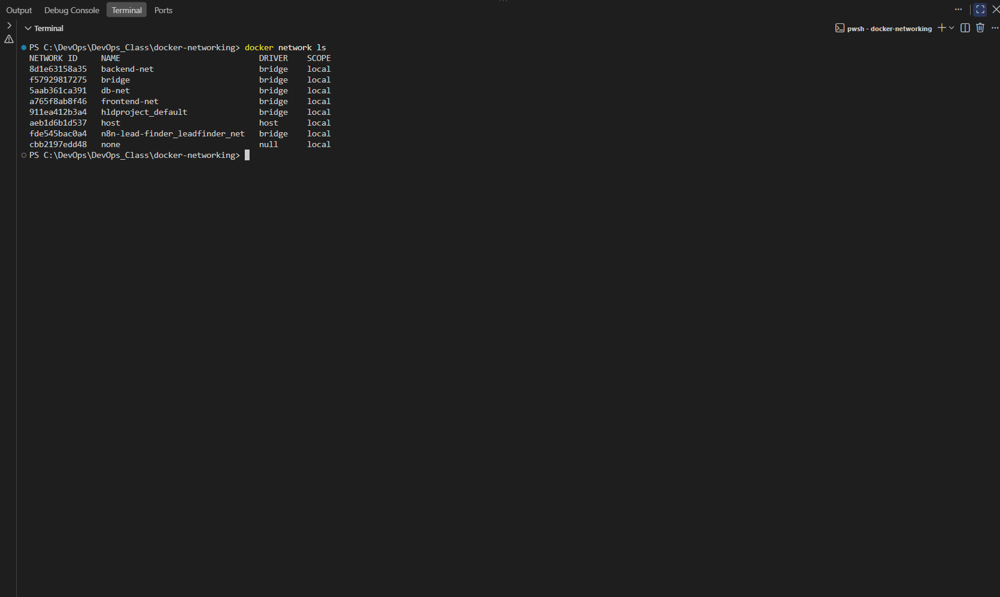
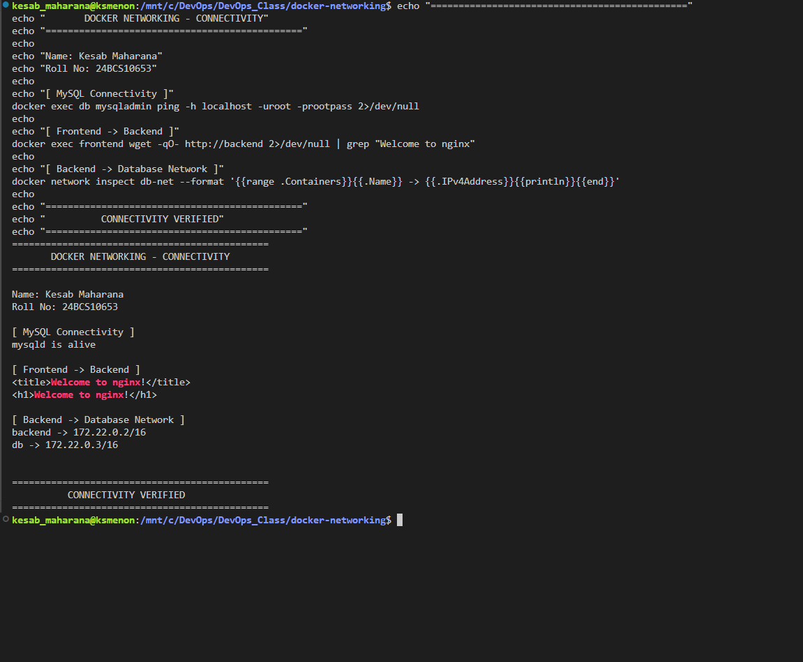
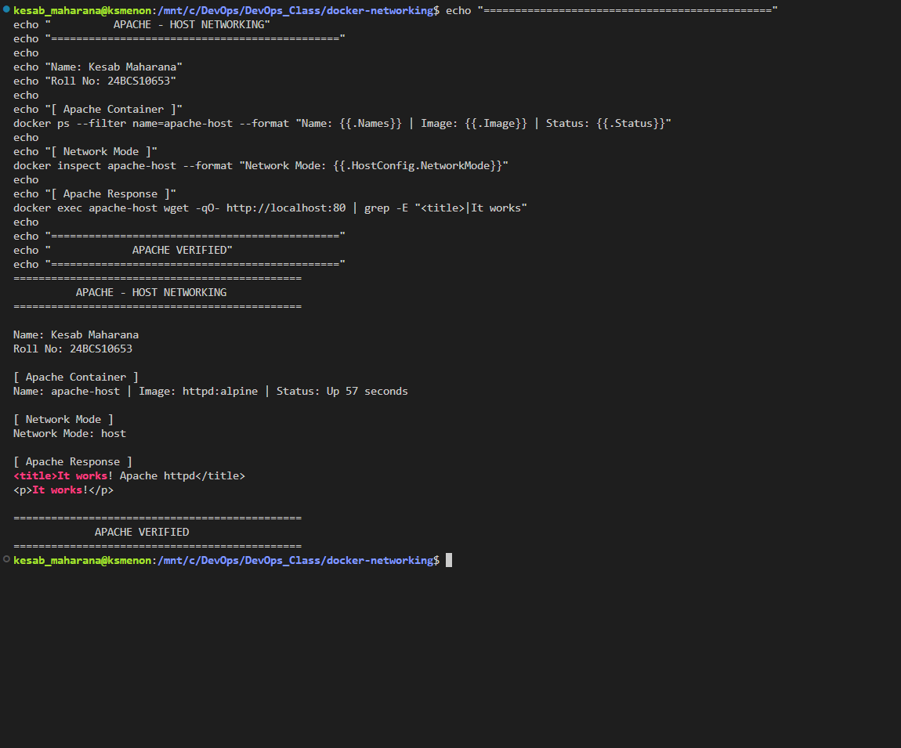

* Kesab Maharana
* 24BCS10653
* WSL/Ubuntu on Windows
* `frontend-net`, `backend-net`, `db-net`
* `frontend`, `backend`, `db`
* Apache `--network host`
* Bind mount on **8084**, not 8082
* Your actual bind-mount HTML content
* Your actual screenshots

### Replace the entire `readme.md` with this

````markdown
# Session 8 — Docker Networking & Volumes

## Student Information

**Name:** Kesab Maharana  
**Roll No.:** 24BCS10653

---

## Objective

The objective of this practical was to understand Docker networking and
volumes through hands-on exercises.

The practical covered:

- Creating custom Docker bridge networks
- Connecting containers to multiple networks
- Testing container-to-container connectivity
- Using Docker host networking
- Performing a bind mount
- Understanding overlay networks and their use cases

---

# 1. Creating Docker Networks

Three custom Docker bridge networks were created:

```bash
docker network create frontend-net
docker network create backend-net
docker network create db-net
````

The available Docker networks were verified using:

```bash
docker network ls
```

The three custom networks were successfully created using the `bridge`
network driver.

### Screenshot



---

# 2. Creating Frontend, Backend and Database Containers

## Frontend Container

An Nginx Alpine container was created on the frontend network:

```bash
docker run -d --name frontend --network frontend-net nginx:alpine
```

## Backend Container

Another Nginx Alpine container was created on the backend network:

```bash
docker run -d --name backend --network backend-net nginx:alpine
```

The backend container was then connected to the frontend network:

```bash
docker network connect frontend-net backend
```

It was also connected to the database network:

```bash
docker network connect db-net backend
```

Therefore, the backend container was connected to:

```text
frontend-net
backend-net
db-net
```

This demonstrates that a single Docker container can participate in multiple
networks and communicate with different groups of containers.

## Database Container

A MySQL 8 container was created on the database network:

```bash
docker run -d \
  --name db \
  --network db-net \
  -e MYSQL_ROOT_PASSWORD=rootpass \
  mysql:8
```

---

# 3. Container Connectivity

## Frontend → Backend

Connectivity from the frontend container to the backend container was tested
using:

```bash
docker exec frontend wget -qO- http://backend
```

The request successfully returned the Nginx welcome page.

This confirms that the frontend container could resolve the backend container
using its Docker network name and communicate with it.

The connectivity was also verified using:

```bash
docker exec frontend wget -qO- http://backend | grep "Welcome to nginx"
```

Result:

```text
<h1>Welcome to nginx!</h1>
```

## Backend → Database Network

The backend container was connected to the database network using:

```bash
docker network connect db-net backend
```

The database network was inspected to verify that both the backend and database
containers were connected:

```bash
docker network inspect db-net
```

The network showed:

```text
backend
db
```

with their respective IP addresses.

## MySQL Connectivity

The MySQL server was verified using:

```bash
docker exec db mysqladmin ping -h localhost -uroot -prootpass
```

Result:

```text
mysqld is alive
```

This confirms that the MySQL server was running successfully.

### Screenshot



---

# 4. Apache Using Host Network

The Apache HTTP Server Alpine image was pulled using:

```bash
docker pull httpd:alpine
```

A container was then started using Docker's host network:

```bash
docker run -d --name apache-host --network host httpd:alpine
```

The network mode was verified using:

```bash
docker inspect apache-host --format "Network Mode: {{.HostConfig.NetworkMode}}"
```

Result:

```text
Network Mode: host
```

Apache was tested from inside the container using:

```bash
docker exec apache-host wget -qO- http://localhost:80
```

The response confirmed that Apache was running:

```text
<title>It works! Apache httpd</title>
<p>It works!</p>
```

This demonstrates that the container was using the host network mode instead of
Docker's normal bridge networking.

### Screenshot



---

# 5. Bind Mount

A bind mount was used to share a directory on the host machine with an Nginx
container.

The working directory was:

```bash
cd /mnt/c/DevOps/DevOps_Class/docker-networking/bind-mount
```

An `index.html` file was created on the host containing:

```html
<!DOCTYPE html>
<html>
<head>
    <title>Docker Bind Mount</title>
</head>
<body>
    <h1>Before Bind Mount Update</h1>
    <p>Name: Kesab Maharana</p>
    <p>Roll No: 24BCS10653</p>
</body>
</html>
```

The Nginx container was started with the current directory mounted into the
Nginx web root:

```bash
docker run -d \
  --name bind-nginx \
  -p 8084:80 \
  -v "$(pwd):/usr/share/nginx/html" \
  nginx:alpine
```

The application was accessed through:

```text
http://localhost:8084
```

### Before Modification

The browser displayed:

```text
Before Bind Mount Update

Name: Kesab Maharana
Roll No: 24BCS10653
```


---

## Modifying the Mounted File

The host-side `index.html` file was then modified without restarting the
container.

The updated file contained:

```html
<!DOCTYPE html>
<html>
<head>
    <title>Docker Bind Mount</title>
</head>
<body>
    <h1>Bind Mount Updated Successfully!</h1>
    <p>Name: Kesab Maharana</p>
    <p>Roll No: 24BCS10653</p>
    <p>Updated directly from the host without restarting the container.</p>
</body>
</html>
```

The browser was refreshed without restarting the Nginx container.

The updated content appeared immediately.

This demonstrates that changes made to the host file are directly reflected
inside the container through the bind mount.

### After Modification


---

# 6. Understanding Overlay Networks

An overlay network is a Docker network designed to allow containers running on
different Docker hosts to communicate with each other.

Unlike a standard bridge network, which normally operates within a single
Docker host, an overlay network can span multiple Docker hosts.

## Common Use Cases

Overlay networks are commonly used for:

* Docker Swarm services
* Multi-host container communication
* Distributed applications
* Microservice architectures
* Container communication across multiple Docker hosts

Conceptually:

```text
Docker Host 1                    Docker Host 2

┌──────────────┐                 ┌──────────────┐
│ Container A  │                 │ Container B  │
└──────┬───────┘                 └──────┬───────┘
       │                                │
       └────────── Overlay Network ─────┘
```

The overlay network provides a logical network that spans multiple Docker
hosts, allowing participating containers or services to communicate across
those hosts.

---

# 7. Important Docker Commands

| Command                  | Purpose                                       |
| ------------------------ | --------------------------------------------- |
| `docker network create`  | Creates a Docker network                      |
| `docker network ls`      | Lists Docker networks                         |
| `docker network connect` | Connects a container to another network       |
| `docker network inspect` | Displays detailed network information         |
| `docker run --network`   | Starts a container on a specified network     |
| `docker exec`            | Executes a command inside a running container |
| `docker pull`            | Downloads an image from Docker Hub            |
| `docker ps`              | Lists running containers                      |
| `--network host`         | Uses the host network for a container         |
| `-v`                     | Creates a bind mount                          |
| `wget`                   | Tests HTTP connectivity                       |
| `mysqladmin ping`        | Checks whether MySQL is running               |

---

# 8. Key Learnings

Through this practical, I learned:

1. Docker containers can communicate using Docker network names.
2. Custom bridge networks provide isolated container communication.
3. A single container can be connected to multiple Docker networks.
4. Containers on the same network can resolve each other using container names.
5. Host networking removes the normal Docker network isolation for the
   container.
6. Bind mounts allow host files and directories to be shared with containers.
7. Changes to bind-mounted files can be reflected without restarting the
   container.
8. Overlay networks can provide communication between containers or services
   across multiple Docker hosts.

---

# Conclusion

This practical provided hands-on experience with Docker networking and
volumes.

I created multiple custom bridge networks and connected frontend, backend, and
database containers to the appropriate networks. Container-to-container
communication was tested using Docker DNS and HTTP requests, while MySQL
connectivity was verified using `mysqladmin`.

I also configured an Apache container using host networking and verified the
Apache HTTP server from inside the container.

Finally, I performed a bind mount using Nginx and demonstrated that changes
made to a host-side HTML file were immediately reflected inside the running
container without restarting it.

Overall, the practical demonstrated Docker network isolation, container
discovery, multi-network connectivity, host networking, and bind mounts.

```